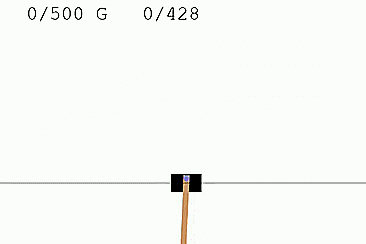
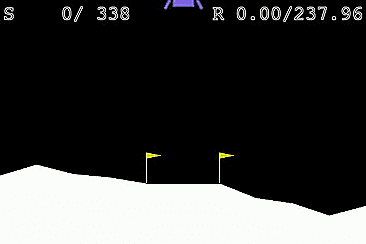
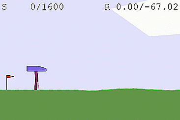
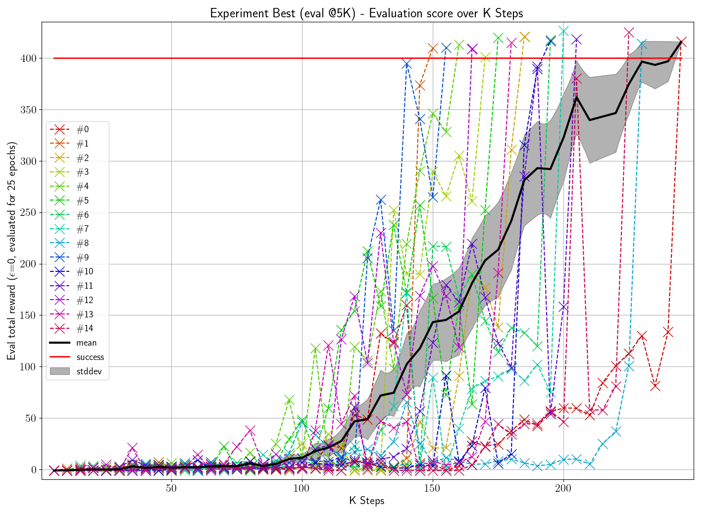
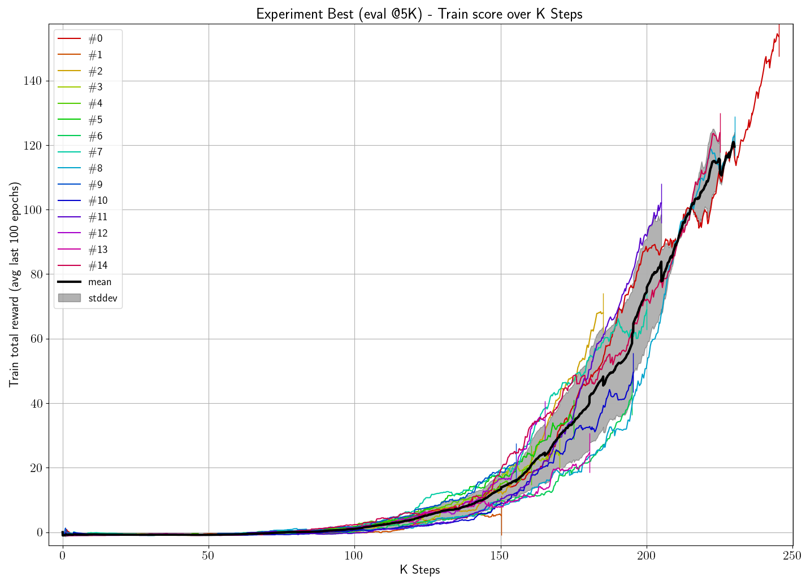

# Solving the Continuous Cartpole problem

Ging S., Younes A., Baslan N. -- 3 week project for the Reinforcement Learning course at the University of Freiburg.

[Overview (2 slides)](./slides_overview.pdf)

[Full slide set](./slides_full.pdf)

## Problem Description

Environment: Continuous Cartpole
- Start with pole at the bottom
- `1` reward for the pole being at the top, `-1` reward and termination when off the screen, `0` reward else
- Max `500` steps per episode
- Observation space: Cart position, cart velocity, pole angle, pole velocity at tip
- Action space: continuous in [-1, 1] 
    - Discretized for DQN

## Algorithm

DQN as proposed in [1] with

- Soft target network update as in [2]
- Double Q Learning as in [3]
- Dueling Network Architecture as in [4]

Our best configuration solves the problem in ~190K steps (~800 episodes) tested with 15 different random seeds.

Best agent ([video](./_media/agent.mp4)):



## Installation

### Environment

Tested with Win10: `Python==3.8.6 PyTorch==1.6.0 CUDA==10.1 TorchVision==0.7.0 Pillow==7.2.0`

### Latex

Installing a Latex distribution is recommended for better plots. If you get Latex errors, run the script with `--disable_tex` to disable it.

### Setup steps

```bash
git clone https://github.com/gingsi/rl-continuouscartpole.git
cd rl-continuouscartpole
# change the torch installation command below depending on your GPU
pip install torch==1.6.0+cu101 torchvision==0.7.0+cu101 -f https://download.pytorch.org/whl/torch_stable.html
pip install -r requirements.txt
```

## Evaluation

We provide the agent models for 2 selected experiments (best config with eval and train metric) with 15 different runs. All logged metrics are provided so all plots can be recreated. All created plots and data are also provided in `test_results/`.

### Run agent 

```bash
# watch highest quality agent (highest eval score: 426.500 +- 0.842 over 1000 evaluation episodes)
python -m src.eval vanilla-v6-baseline-step-eval5k run1 --log_dir runs_best --run_number 7 --render

# watch fastest converging agent (converged after 150k steps, 834 episodes)
python -m src.eval vanilla-v6-baseline-step-eval5k run1 --log_dir runs_best --run_number 1 --render

# watch random agent
python -m src.tests.run_cartpole_random

# watch untrained agent
python -m src.eval vanilla-v6-baseline-step-eval5k run_untrained --run_number 0 --render

# create video of highest quality agent
python -m src.eval vanilla-v6-baseline-step-eval5k run1 --log_dir runs_best --run_number 7 --render --video

# do agent quality test for 100 episodes of highest quality agent
python -m src.eval vanilla-v6-baseline-step-eval5k run1 --eval_episodes 100 --log_dir runs_best --overwrite --run_number 7

# run best agent for 100K steps to see if he ever falls down
python -m src.eval vanilla-v6-baseline-step-eval5k run1 --eval_episodes 1 --num_steps 100000 --log_dir runs_best --run_number 7 --overwrite

```

### Analysis and plots

```bash
# create txt/csv analysis of all experiments
python -m src.eval_list all run1 --log_dir runs_no_models --no_plots --performance_dir performance_saved

# ---------- evaluate scores: recreate plots/csv/text information
# the 5 experiments presented in slides
python -m src.eval_list presented run1 --log_dir runs_no_models --performance_dir performance_saved
# the 3 good experiments presented
python -m src.eval_list presented-good run1 --log_dir runs_no_models --performance_dir performance_saved
# all experiments, no single runs, sorted by steps until convergence
python -m src.eval_list all run1 --log_dir runs_no_models --no_single_plots --sort --performance_dir performance_saved
# top10 experiments (lowest steps)
python -m src.eval_list all run1 --log_dir runs_no_models --no_single_plots --sort --topk 10 --performance_dir performance_saved
# for meaningful training score comparison plots: only shaped
python -m src.eval_list all-shaped run1 --log_dir runs_no_models --no_single_plots --performance_dir performance_saved
# for meaningful training score comparison plots: only sparse
python -m src.eval_list all-sparse run1 --log_dir runs_no_models --no_single_plots --performance_dir performance_saved
# plot epsilon scheduler + hardcoded results from the presented experiments
python -m src.tests.test_eps_scheduler

# ---------- single agent quality evaluation
# recreate agent quality plots over all runs from existing data (tested 1000 episodes)
# also recreates the evaluation data used in slide 2, performance table, column Evaluation (1000 ep)
python -m src.eval vanilla-v6-baseline-step-eval5k run1 --eval_episodes 1000 --log_dir runs_no_models
python -m src.eval vanilla-v6-baseline-step-eval20k run1 --eval_episodes 1000 --log_dir runs_no_models
python -m src.eval vanilla-v6-baseline-step-train run1 --eval_episodes 1000 --log_dir runs_no_models
python -m src.eval vanilla-v6-baseline-time-eval5k run1 --eval_episodes 1000 --log_dir runs_no_models
python -m src.eval vanilla-v0 run1 --eval_episodes 1000 --log_dir runs_no_models

```

## Training

All experiment configurations are provided.

Please note that GPU training is not necessarily faster than CPU training due to small models. It all depends on your setup.

### Sequential training

Running one experiment at a time either on GPU or CPU.

```bash
# ---------- train
# train best experiment, 1 runs, CUDA
python -m src.run vanilla-v6-baseline-step-eval5k run2 --reset --cuda

# train best experiment, 4 more runs, CPU
python -m src.run vanilla-v6-baseline-step-eval5k run2 --reset --run_start 1 --run_end 5

# ---------- evaluate
# evaluate all 5 runs of the experiment for 100 episodes
python -m src.eval vanilla-v6-baseline-step-eval5k run2 --eval_episodes 100 --overwrite

# create plots / more extensive analysis for this single experiment with 5 runs
python -m src.eval_list best-single run2

```

### Multiprocessing

Running multiple experiments in parallel on the CPU.

Since PyTorch internally does multiprocessing when CPU training, it's important to limit the number of threads per worker to avoid locks. This example works for 8 cores (4 workers with 2 threads each). Formula: `num_cores >= num_workers * num_threads`. To run single experiments in multiprocessing, create a new list in `config/lists/` containing only a single experiment name.

```bash
export OMP_NUM_THREADS=2
export MKL_NUM_THREADS=2

# train the 5 experiments in the slides, 5 runs each, multiprocessing (will take a while)
python -m src.submit presented run2 --run_end 5 --num_workers 4 --num_threads 2 --reset

# evaluate the presented runs trained with the command before
python -m src.eval_list presented run2

# clean up everything except best and last checkpoints/metrics files for all experiments
python -m src.cleanup_list presented run2 --delete

```

### Further evaluation

To evaluate your results more deeply, use the code from chapter **Evaluation**, change `run1` to `run2` and remove the `--log_dir` argument.

## Other code

```bash
# re-evaluate performance of the presented experiments (approx cpu/gpu time per step)
python -m src.performance_list presented --save --cleanup
python -m src.performance_list presented --save --cleanup --cuda

# time profile the best configuration for 10000 steps on CPU
python -m cProfile -s cumtime -o profiling/dqnprofile.pstats src\run.py vanilla-v6-baseline-step-eval5k test-profile --reset --max_steps 10000
python -m src.read_profiler profiling/dqnprofile.pstats

```

## Other environments

For this part, we ran our algorithm on other gym environments. No code, config or evaluation is provided, only a short qualitative analysis. 

### LunarLander-v2

[video](./_media/lander.mp4)

The best config works off-the-shelf on this problem which has a discrete action space. Problem solved after 520k steps (2419 episodes):



### BipedalWalker-v2

[video](./_media/walker.mp4)

In this problem, the agent gets punished more for applying stronger torque to the joints, the action space is 4-dimensional and continuous. So either the discretization (we chose 3) is too coarse and the agent applies too much torque or the curse of dimensionality hits (`num_actions = num_discretization ^ 4`) and the agent has problems learning. Our algorithm does not solve this problem well, at least not off-the-shelf. Performance after 980k steps (3345 episodes):



## Training / evaluation curves

For more visualizations, see the full slide set or the folder `test_results/`.

### Best config (least steps)

#### Evaluation curve



#### Training curve



## Repository content details

- `_media` images / videos for the readme
- `_misc` open source courier new font for video creation
- `config/experiments/` single experiment configuration
- `config/lists/` experiment list for evaluations
- `performance/` experiment performance (mean CPU/GPU time per step for 5 trials with 10k steps)
- `performance_saved/` profiled experiment performance to recreate plots
- `profiling/` empty directory to be used by python cProfile
- `runs/` folder to store models and metrics, initially not existing
- `runs_best/` the 15 runs of the best experiment including agent weights
- `runs_no_models/` all metrics of all runs of all experiments, without agent weights 
- `src/` the code
- `test/` output folder of created plots, initially not existing
- `test_results/` all plots and metrics:
    - `_LISTNAME_run1/` plots of multiple experiments.
    - `csv/` metrics evaluation as raw data.
    - `eps_schedulers/` epsilon schedulers + hardcoded experiment results in a plot.
    - `eval/` agent quality evaluation per experiment.
    - `step/`, `time_cpu/`, `time_gpu/` single experiment plots over different x-axis metrics.
    - `txt/` metrics evaluation as human-readable data.

## References

- [1] Mnih, V. et al (2015), Human Level Control Through Deep Reinforcement Learning
([pdf](https://web.stanford.edu/class/psych209/Readings/MnihEtAlHassibis15NatureControlDeepRL.pdf))
- [2] Lillicrap, T. et al (2015), Continuous control with deep reinforcement learning
([arxiv](https://arxiv.org/abs/1509.02971))
- [3] van Hasselt, H. et al (2016), Deep Reinforcement Learning with Double Q-learning
([arxiv](https://arxiv.org/abs/1509.06461))
- [4] Wang, Z. et al (2015), Dueling Network Architectures for Deep Reinforcement Learning
([arxiv](https://arxiv.org/abs/1511.06581))
- [5] Hessel, M. et al (2017), Rainbow: Combining Improvements in Deep Reinforcement Learning
([arxiv](https://arxiv.org/abs/1710.02298))
- [6] Maroti, A., RBED: Reward Based Epsilon Decay
([arxiv](https://arxiv.org/abs/1910.13701))

